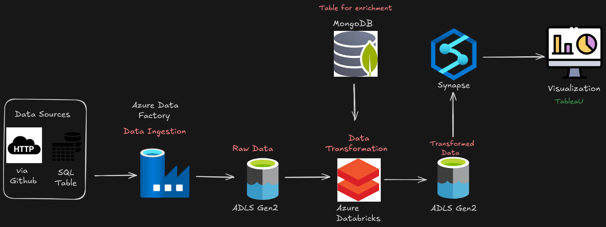
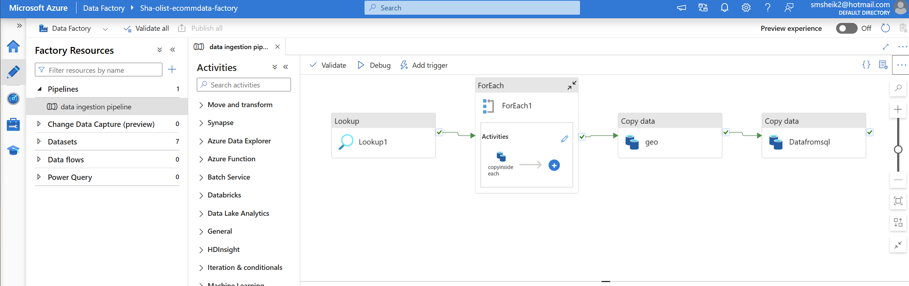
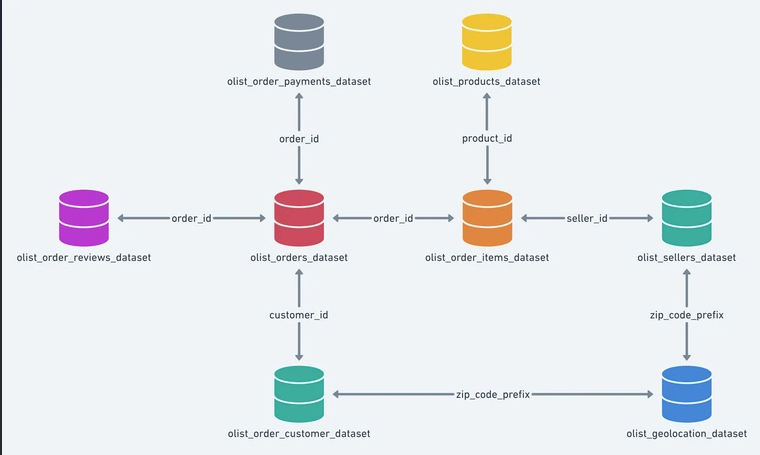
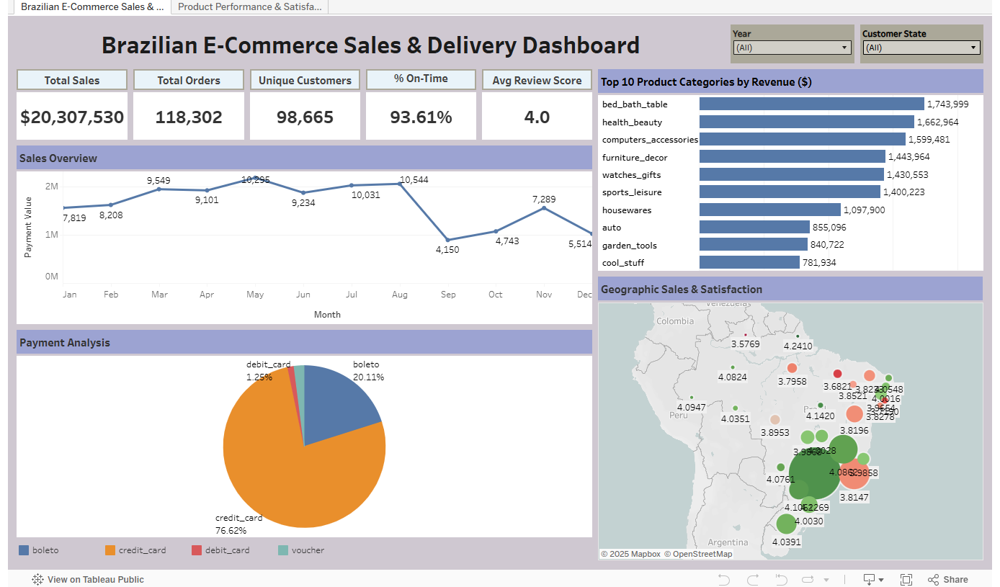
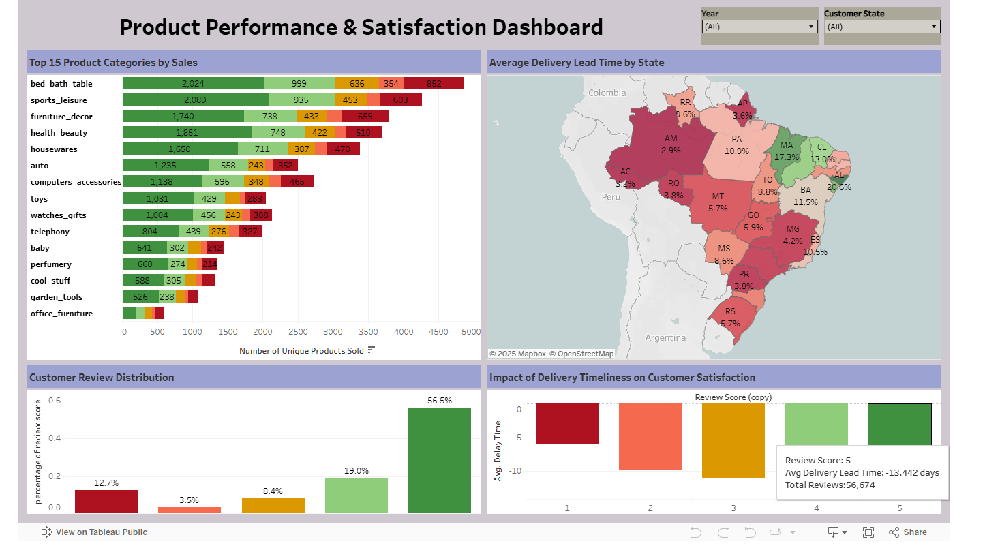

# 🛒 Olist Brazilian E-Commerce Data Engineering Project  

## 📘 Project Overview  
This project demonstrates an **end-to-end Azure-based data engineering pipeline** built using the **Brazilian E-Commerce (Olist)** dataset.  
The goal is to design, automate, and visualize the entire data lifecycle — from ingestion to analytics-ready dashboards — using modern data engineering tools on Azure.

---

## 🧩 Architecture   


## ⚙️ Data Ingestion Pipeline – Azure Data Factory



The pipeline is **metadata-driven** and dynamically fetches file information from **JSON configuration files** stored in **GitHub**.  
Each pipeline run extracts the necessary parameters from JSON (such as file paths, dataset names, and storage destinations) and ingests data accordingly.

### 🔹 Pipeline Components
1. **Lookup Activity**  
   - Reads JSON files directly from the GitHub source repository.  
   - Extracts metadata such as file names, schema paths, and ADLS destinations.  
   - Serves as the **control configuration** for all ingestion logic.  

2. **ForEach Activity**  
   - Iterates through each dataset entry from the Lookup JSON output.  
   - Dynamically executes the Copy Data activity for each dataset listed in the JSON.  

3. **Copy Data (geo)**  
   - Fetches *geolocation dataset* from GitHub (HTTP link).  
   - Writes the data into the **Raw zone** of ADLS in Parquet format.  

4. **Copy Data (Datafromsql)**  
   - Connects to a **SQL Database** (e.g., Orders, Products, Payments tables).  
   - Copies tabular data into ADLS Raw zone for transformation in Databricks.  

### 🔹 Purpose  
- Enables **parameterized and reusable ingestion** using GitHub JSON files as control metadata.  
- Simplifies pipeline maintenance — new datasets can be added by simply updating the JSON file.  
- Ensures consistency and scalability across multiple data sources.  
- Acts as the **first stage (Bronze Layer)** in the Azure Data Lakehouse workflow before transformation in Databricks and modeling in Synapse.

### 🔹 Data Flow Summary  
1. **Data Ingestion – Azure Data Factory**  
   - Pulls data from **GitHub (HTTP)** and **MySQL Database**.  
   - Stores data into **Azure Data Lake Storage Gen2 (Raw Zone)**.  

2. **Data Transformation – Azure Databricks**  
   - Reads raw data from ADLS.  
   - Cleans and joins tables using **PySpark** and **Spark SQL**.  
   - Performs enrichment by merging additional reference data from **MongoDB**.  
   - Writes curated data back to ADLS (Transformed Zone).  

3. **Data Modeling – Azure Synapse Analytics**  
   - Creates **external tables** on top of transformed Parquet files.  
   - Enables SQL-based analytics and BI connections.  

4. **Visualization & Insights**  
   - Connects **Tableau** to Synapse( we can also Integrate **Fabric** or **PowerBI**) for dashboards.  
   - Dashboards highlight:
     - Sales and revenue trends  
     - Payment behavior  
     - Delivery delays  
     - Customer Review Scores and Delivery Satisfaction  

---

## 🧱 Tech Stack  
| Layer | Tools & Services |
|-------|------------------|
| Ingestion | Azure Data Factory |
| Storage | Azure Data Lake Storage Gen2 |
| Transformation | Azure Databricks (PySpark, SQL) |
| Enrichment | MongoDB |
| Data Warehouse | Azure Synapse Analytics |
| Visualization | Power BI, Tableau, Microsoft Fabric |

---

## 🗂️ Dataset Overview  

**Source:** [Olist Brazilian E-Commerce Dataset (Kaggle)](https://www.kaggle.com/datasets/olistbr/brazilian-ecommerce)  

The dataset consists of multiple relational tables describing orders, customers, sellers, payments, reviews, and products from the Olist e-commerce platform.

---

## 🧮 Data Model / Schema  
Below is the schema representing how the datasets are related:



### Key Relationships  
| Table | Key Column | Linked Table | Relationship |
|--------|-------------|---------------|--------------|
| `olist_orders_dataset` | `order_id` | `olist_order_items_dataset` | 1 → Many |
| `olist_orders_dataset` | `order_id` | `olist_order_reviews_dataset` | 1 → Many |
| `olist_orders_dataset` | `order_id` | `olist_order_payments_dataset` | 1 → Many |
| `olist_orders_dataset` | `customer_id` | `olist_order_customer_dataset` | Many → 1 |
| `olist_order_items_dataset` | `product_id` | `olist_products_dataset` | Many → 1 |
| `olist_order_items_dataset` | `seller_id` | `olist_sellers_dataset` | Many → 1 |
| `olist_sellers_dataset` | `zip_code_prefix` | `olist_geolocation_dataset` | Many → 1 |
| `olist_order_customer_dataset` | `zip_code_prefix` | `olist_geolocation_dataset` | Many → 1 |

---

## ⚙️ Key Features
- Automated **ETL pipeline** using Azure Data Factory and Databricks.  
- Implemented **Medallion Architecture** with Bronze (Raw), Silver (Transformed), and Gold (Analytics) layers.  
- Data transformation and cleansing performed using **PySpark** in Databricks.  
- **External tables** created in Azure Synapse Analytics for BI integration.  
- Designed interactive **Tableau dashboards** for sales, delivery, and product insights.

---
## 📊 Dashboard Previews  

### 🟣 **Sales & Delivery Dashboard**


**Highlights:**
- KPIs for total sales, unique customers, on-time delivery %, and average review score.  
- **Sales Overview** – Monthly revenue trend.  
- **Payment Analysis** – Breakdown of payment types (credit, boleto, debit).  
- **Top Categories by Revenue** – Identifies highest-performing product categories.  
- **Geographic Sales & Satisfaction** – Map view of customer ratings and sales density.

---

### 🟠 **Product Performance & Satisfaction Dashboard**


**Highlights:**
- **Top Product Categories** – Visual breakdown of category-level sales volume.  
- **Average Delivery Lead Time by State** – Map visualization of delivery performance across Brazil.  
- **Customer Review Distribution** – Sentiment insights based on review scores.  
- **Impact of Delivery Timeliness** – Analyzes how delivery time affects satisfaction ratings.
---

## 📁 Repository Structure

```text
├── data/
│ ├── raw/
│ └── transformed/
├── notebooks/
│ ├── Data_ingestion.ipynb
│ ├── databricks_code_transformation.py
├── sql/
│ └── synapse_gold_layer_tables.sql
├── reports/
│ └── dashboards.pbix
├── dashboards/
│ ├── brazilian_ecommerce_dashboard.png
│ └── product_performance_dashboard.png
├── architecture/
│ ├── architecture_diagram.png
│ └── Schema.png
└── README.md
